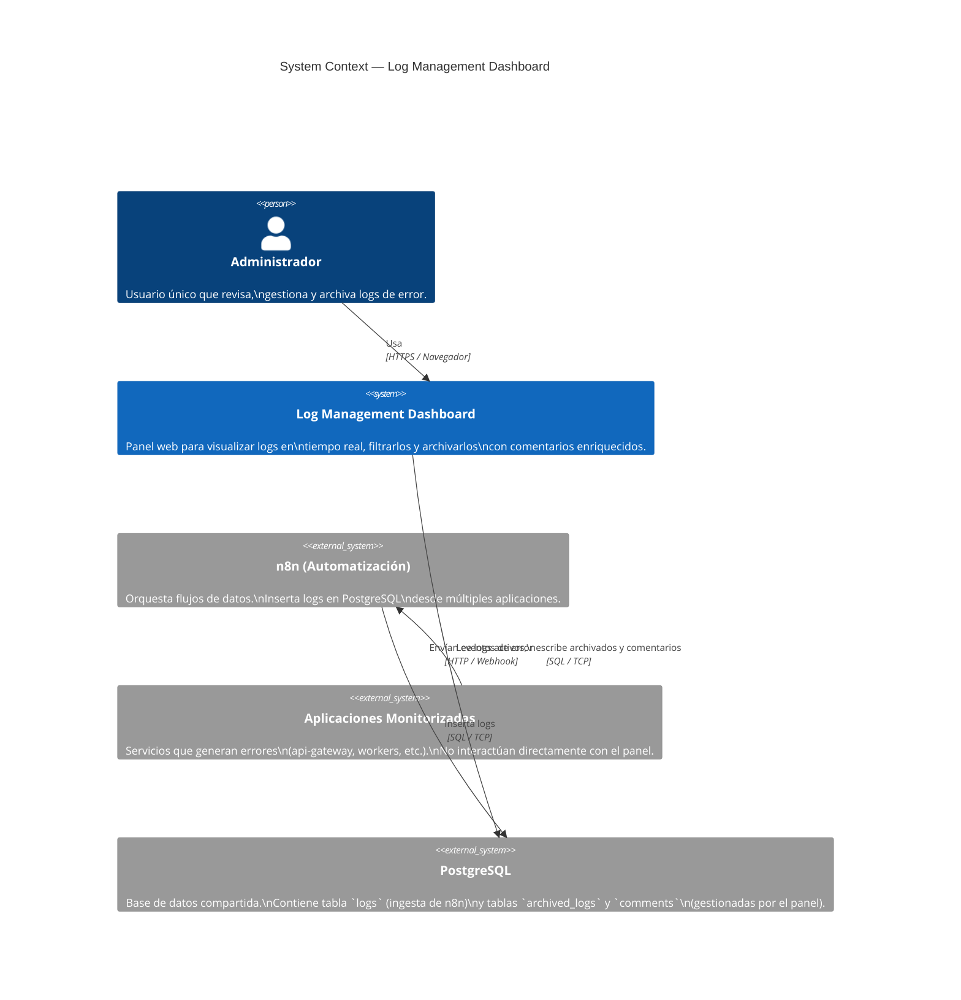
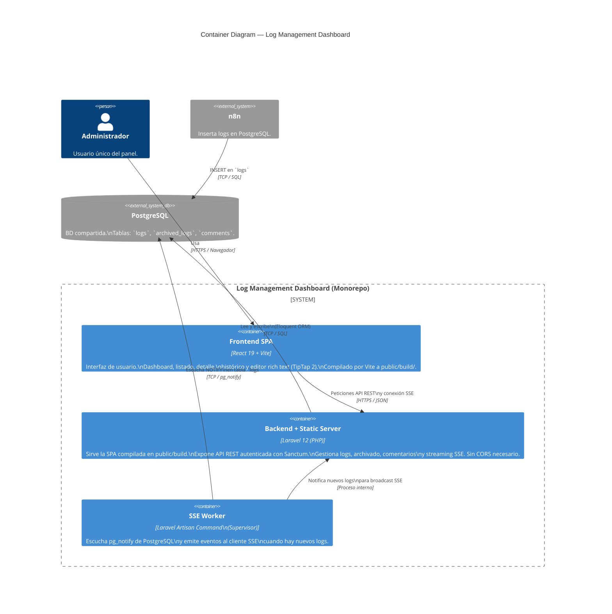
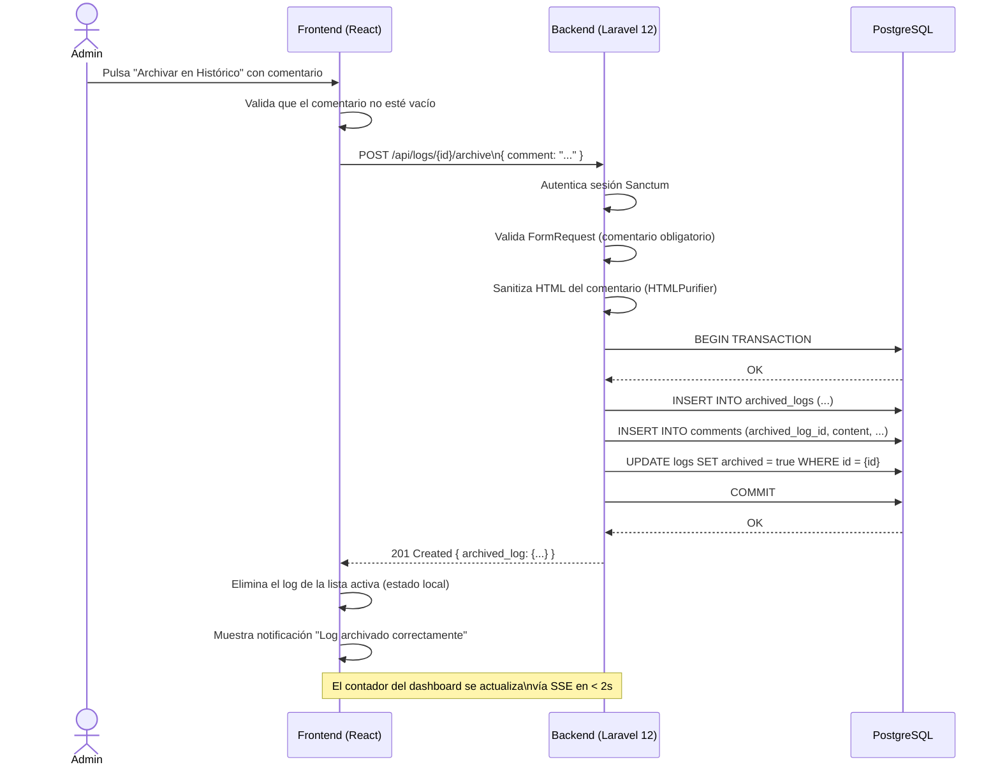
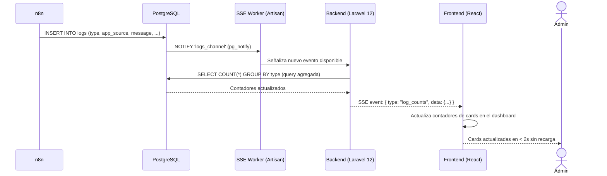
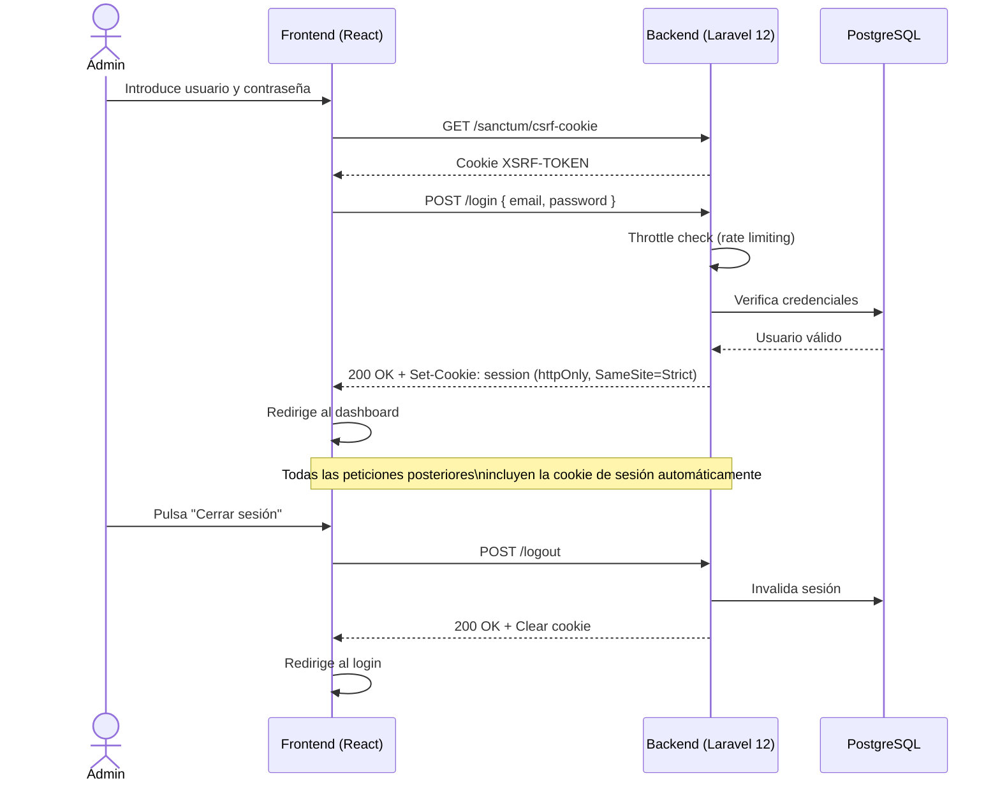
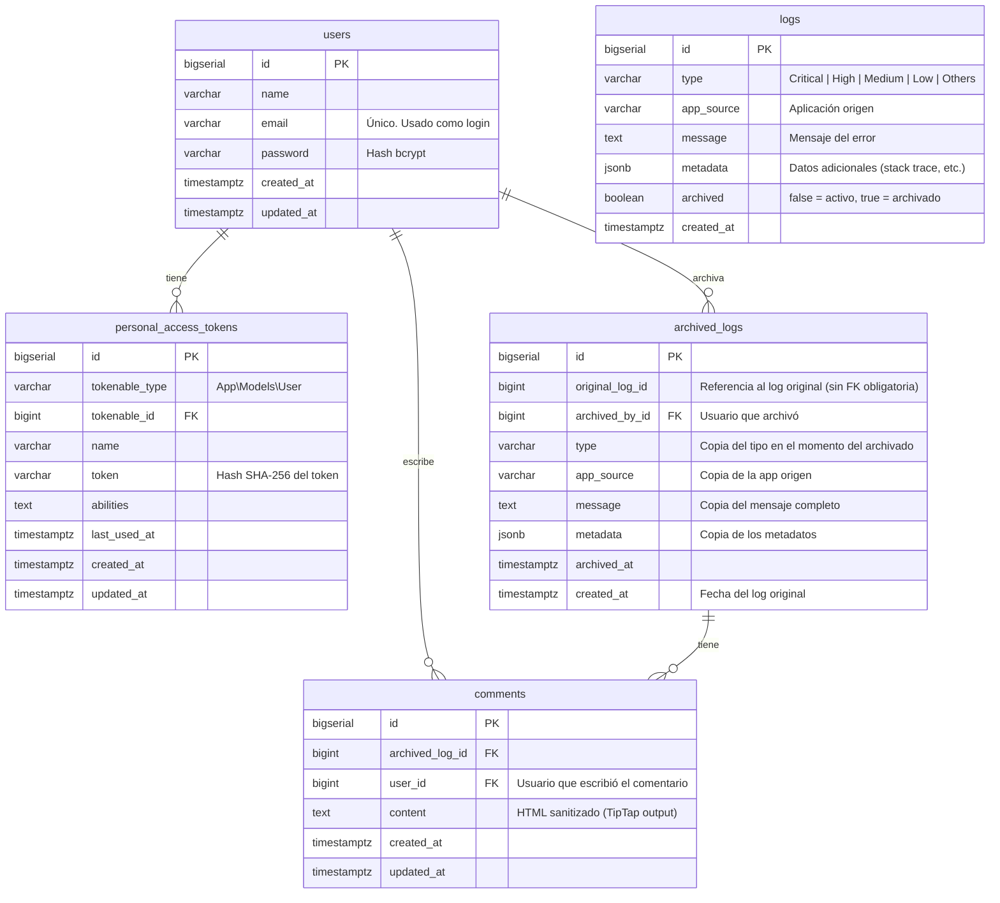
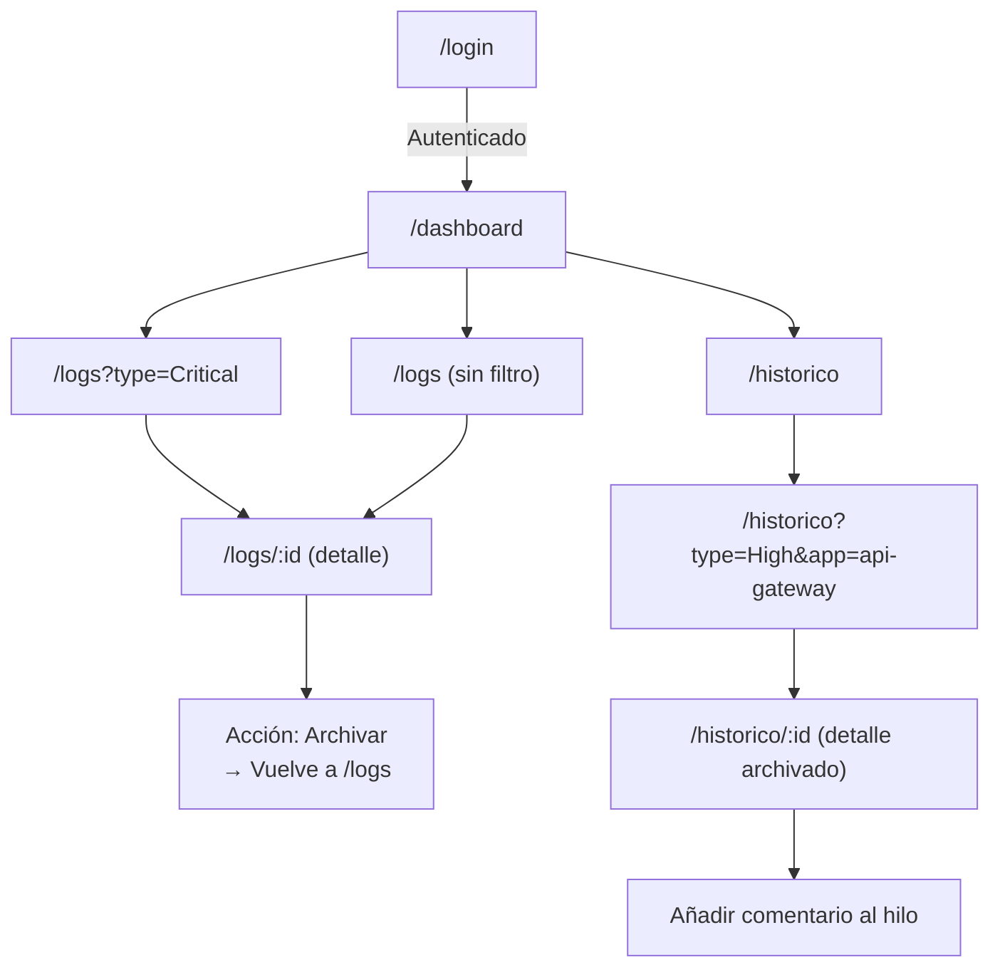

# 📐 Documentación Visual — Log Management Dashboard

**Proyecto:** Panel de Administración y Gestión de Logs Multi-Aplicación
**Fecha:** 2026-03-03
**Skill:** System Architect — C4 Model + Flujos
**Estado:** FASE 4 Completada

---

## 1. C4 Level 1 — System Context

> Cómo el sistema encaja en el mundo, interactuando con usuarios y sistemas externos.

---

## 2. C4 Level 2 — Container Diagram

> Las aplicaciones y bases de datos que componen el sistema.

---

## 3. Flujo 1 — Archivado de un Log

> Secuencia completa desde que el admin decide archivar hasta que el log desaparece de la vista activa.

---

## 4. Flujo 2 — Actualización en Tiempo Real (SSE)

> Cómo un nuevo log insertado por n8n llega al dashboard del administrador.

---

## 5. Flujo 3 — Autenticación SPA (Sanctum)

> Login del administrador y protección de rutas.

---

## 6. Diagrama de Base de Datos (Entity-Relationship)

> Schema completo de PostgreSQL. La tabla `logs` es de solo lectura para el panel (la gestiona n8n). Las tablas `archived_logs` y `comments` son creadas y gestionadas por el panel.

> **Notas de diseño:**
> - `users` es gestionada por Laravel 12 (migración estándar). Un único registro de administrador creado via seeder.
> - `personal_access_tokens` es la tabla estándar de **Laravel Sanctum** para autenticación SPA con cookies. Se crea automáticamente con `php artisan migrate`.
> - `logs.archived` se marca `true` al archivar. El panel nunca hace DELETE sobre `logs`.
> - `archived_logs` almacena una **copia desnormalizada** de los campos clave del log original para garantizar que el histórico es independiente aunque la tabla `logs` sea purgada por n8n en el futuro.
> - `original_log_id` no tiene FK obligatoria para no generar errores de integridad si n8n limpia la tabla `logs`.
> - `archived_by_id` y `comments.user_id` referencian `users.id` con FK. Permiten auditar quién hizo qué (NFR-OBS-02).
> - El panel **no tiene permiso DELETE ni TRUNCATE** sobre `archived_logs` ni `comments` (STRIDE T-DB-01).

---

## 7. Mapa de Rutas — Frontend (React Router)

