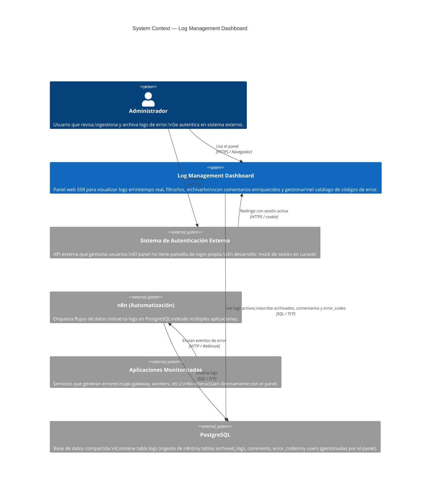
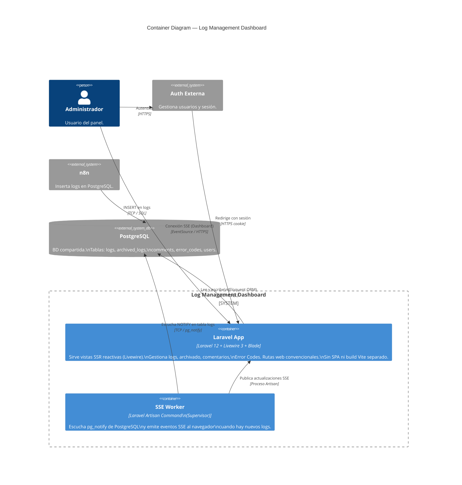
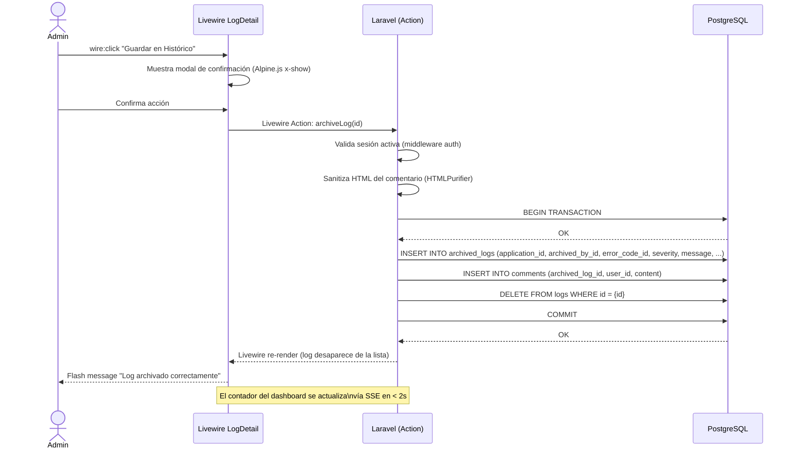
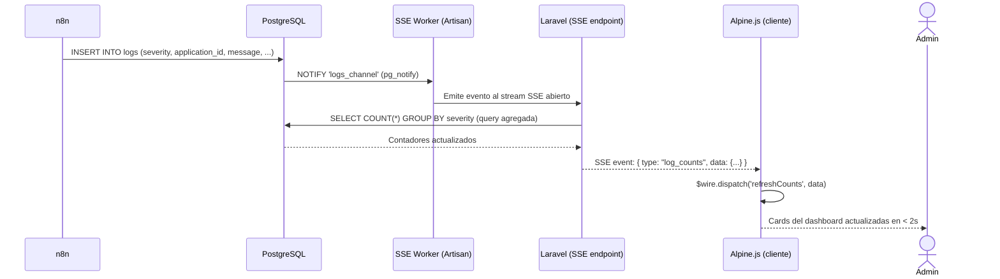
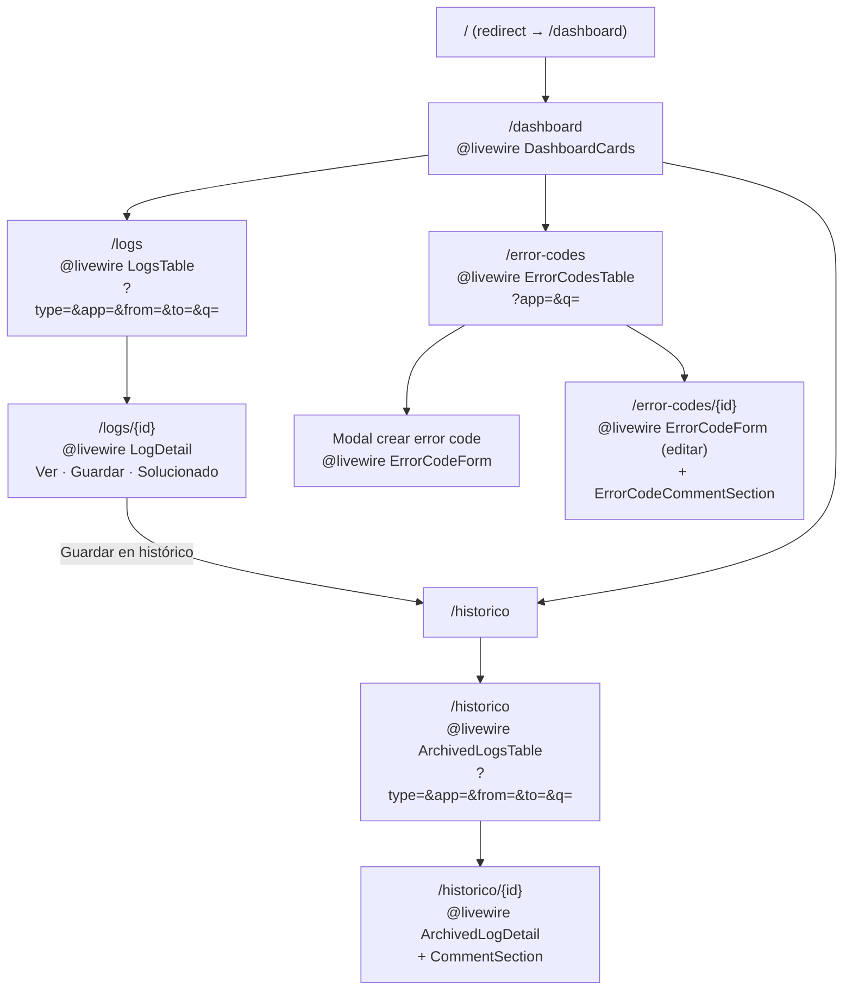

# 📐 Documentación Visual — Log Management Dashboard

**Proyecto:** Panel de Administración y Gestión de Logs Multi-Aplicación
**Fecha:** 2026-03-03 · **Actualizado:** 2026-03-14 (stack Laravel + Livewire 3)
**Skill:** System Architect — C4 Model + Flujos
**Estado:** FASE 4 Completada

---

## 1. C4 Level 1 — System Context

> Cómo el sistema encaja en el mundo, interactuando con usuarios y sistemas externos.



---

## 2. C4 Level 2 — Container Diagram

> Las aplicaciones y bases de datos que componen el sistema.



---

## 3. Flujo 1 — Archivado de un Log (Livewire Action)

> Secuencia desde que el admin decide archivar hasta que el log desaparece de la vista activa.



---

## 4. Flujo 2 — Actualización en Tiempo Real (SSE + Livewire)

> Cómo un nuevo log insertado por n8n llega al dashboard del administrador.



---

## 5. Flujo 3 — Autenticación Externa + Mock de Desarrollo

> El panel no gestiona login. El usuario llega con sesión activa del sistema externo.

```mermaid
sequenceDiagram
    actor Admin
    participant Ext as Auth Externa
    participant LW as Laravel Panel

    Admin->>Ext: Login en sistema externo
    Ext-->>Admin: Token / Cookie de sesión
    Admin->>LW: Accede al panel con cookie
    LW->>LW: Middleware verifica sesión externa
    LW-->>Admin: Acceso concedido → Dashboard

    Note over LW: En DESARROLLO: el middleware devuelve\nun usuario mockeado sin validar auth real.\n"$user = User::find(1);" en AuthMock middleware.

    Admin->>LW: Pulsa "Cerrar sesión"
    LW->>LW: Invalida sesión local
    LW-->>Admin: Redirige a portal externo
```

---

## 6. Diagrama de Base de Datos (Entity-Relationship)

> Schema completo de PostgreSQL actualizado. La tabla `logs` es de solo lectura para el panel (la gestiona n8n).

```mermaid
erDiagram
    applications {
        bigserial   id          PK
        varchar     name        "UK - nombre único"
        text        description
        timestamptz created_at
    }

    users {
        bigserial   id              PK
        varchar     name
        varchar     email           "UK"
        varchar     external_id     "ID auth externo"
        timestamptz created_at
        timestamptz updated_at
    }

    error_codes {
        bigserial   id              PK
        varchar     code            "UNIQUE con application_id"
        bigint      application_id  FK
        varchar     name
        text        description
        severity    severity        "enum: Critical/High/Medium/Low"
        bigint      default_role_id FK "rol responsable"
        timestamptz created_at
        timestamptz updated_at
    }

    logs {
        bigserial   id                      PK
        bigint      error_code_id           FK "nullable - si está catalogado"
        bigint      application_id          FK
        severity    severity                "enum"
        text        message
        varchar     file                    "Fichero donde ocurre"
        integer     line                    "Línea del fichero"
        jsonb       metadata                "Stack trace, contexto"
        bigint      matched_archived_log_id FK "nullable - issue conocido"
        boolean     resolved                "false por defecto"
        timestamptz created_at
    }

    archived_logs {
        bigserial   id                  PK
        bigint      application_id      FK
        bigint      archived_by_id      FK
        bigint      error_code_id       FK "nullable - copia del log original"
        severity    severity
        text        message
        jsonb       metadata
        text        description         "Editable por admin"
        varchar     url_tutorial        "nullable"
        timestamptz original_created_at
        timestamptz archived_at
        timestamptz updated_at
    }

    comments {
        bigserial   id              PK
        bigint      archived_log_id FK
        bigint      user_id         FK
        text        content         "HTML sanitizado"
        timestamptz created_at
        timestamptz updated_at
    }

    error_code_comments {
        bigserial   id              PK
        bigint      error_code_id   FK
        bigint      user_id         FK
        text        content         "HTML sanitizado"
        timestamptz created_at
        timestamptz updated_at
    }

    applications ||--o{ error_codes : "tiene"
    applications ||--o{ logs : "genera"
    applications ||--o{ archived_logs : "tiene"
    users ||--o{ archived_logs : "archiva"
    users ||--o{ comments : "escribe"
    users ||--o{ error_code_comments : "escribe"
    error_codes ||--o{ logs : "cataloga"
    error_codes ||--o{ error_code_comments : "tiene"
    archived_logs ||--o{ comments : "tiene"
    archived_logs ||--o{ logs : "enlaza logs futuros"
```



> **Notas de diseño:**
>
> - `users` contiene los usuarios del panel (sincronizados o mockeados desde auth externa). Sin contraseña local.
> - `logs` usa **DELETE físico** en dos situaciones:
>   1. **Al archivar** (acción del admin): se hace INSERT en `archived_logs` y DELETE inmediato del log original dentro de la misma transacción.
>   2. **Script de purga** (tarea programada — diaria/semanal/mensual): elimina los logs con `resolved = true` más antiguos de N días que no fueron archivados. Se implementa como un `php artisan logs:purge --days=30` registrado en `routes/console.php` con `->daily()`.
> - `logs.resolved` (boolean): estado que el admin puede activar sin archivar. El script de purga usa este flag + `created_at` como criterio de eliminación.
> - **No hay soft delete en `logs`**: la tabla puede recibir miles de logs de múltiples apps y debe mantenerse compacta. El histórico duradero vive en `archived_logs`.
> - `archived_logs` almacena una **copia desnormalizada completa** (`severity`, `message`, `metadata`, `error_code_id`, etc.) para que el histórico sea autónomo una vez que el log original se elimine.
> - `error_codes` tiene **unique constraint en `(code, application_id)`** — clave compuesta de negocio.
> - `archived_logs.url_tutorial` y `description` son editables solo desde la vista de Histórico.
> - El enum de severidad se declara una vez y se reutiliza en `logs` y `archived_logs`:
>
>   ```sql
>   CREATE TYPE severity AS ENUM ('critical', 'high', 'medium', 'low', 'other');
>   ```
>
>   En las migraciones Laravel, usar `$table->enum('severity', ['critical','high','medium','low','other'])`
>   o un cast personalizado con `use HasCasts` + `SeverityEnum::class`.

### Índices recomendados

> Definir en las migraciones Laravel con `Schema::table('logs', ...)` tras crear las columnas.

```php
// logs — rendimiento de los listados principales
$table->index('error_code_id');                               // búsquedas por catálogo
$table->index(['application_id', 'created_at']);              // listado principal (desc)
$table->index(['severity', 'resolved']);                      // filtros combinados
$table->index('matched_archived_log_id');                     // join de enlace a issue

// error_codes — integridad de catálogo
$table->unique(['code', 'application_id']);                   // unicidad de negocio
```

### Matching de logs con issues conocidos (asistido desde la vista de detalle)

> **El log insertado por n8n no tiene contexto** para saber si ya existe un issue archivado similar; ese conocimiento lo tiene el administrador cuando abre la vista de detalle. Por tanto, el campo `matched_archived_log_id` **se rellena manualmente o con sugerencia asistida desde `LogDetail`**, no en el momento del INSERT.

**Flujo en la vista de detalle (`/logs/{id}`):**

1. El admin abre un log activo.
2. Si el log tiene `error_code_id`, el componente Livewire consulta en segundo plano los `archived_logs` con la misma `application_id` + `error_code_id` y los presenta como sugerencias.
3. El admin selecciona el issue conocido (o ignora las sugerencias).
4. El Livewire Action actualiza `logs.matched_archived_log_id`.

```php
// En el componente Livewire LogDetail
public function loadSuggestedMatches(): void
{
    if ($this->log->error_code_id) {
        $this->suggestedMatches = ArchivedLog::where('application_id', $this->log->application_id)
            ->where('error_code_id', $this->log->error_code_id)
            ->latest('archived_at')
            ->limit(5)
            ->get();
    }
}

public function linkToArchivedLog(int $archivedLogId): void
{
    $this->log->update(['matched_archived_log_id' => $archivedLogId]);
    $this->dispatch('matchLinked');
}
```

> `matched_archived_log_id` puede seguir siendo `null` si el admin no encuentra un issue relacionado. Es un campo informativo, no un requisito para archivar.

---

## 7. Mapa de Rutas — Laravel Web Routes



> **Navegación global:** `x-nav` (componente Blade) con enlaces a Dashboard / Logs / Histórico / Error Codes / Cerrar Sesión.
