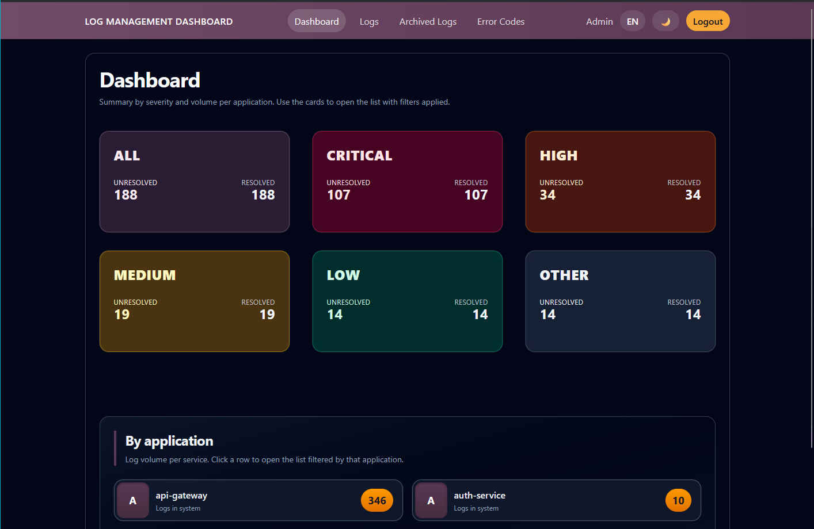
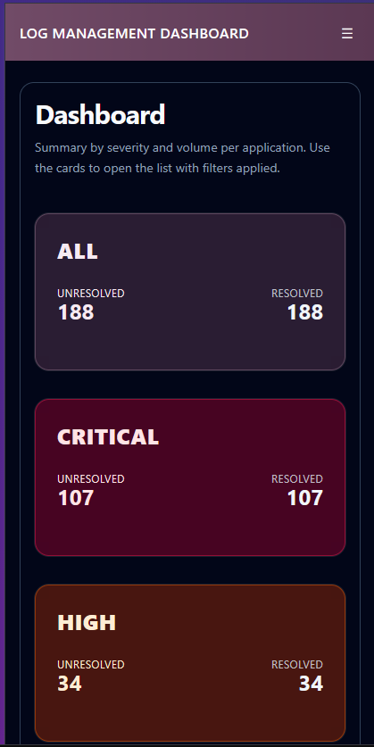
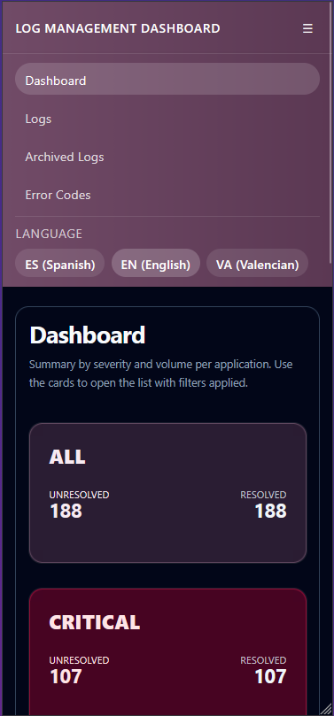

# Dashboard

## Descripcion funcional

El dashboard ofrece una vision resumida del estado actual de los logs del sistema. Presenta tarjetas por severidad para que el usuario pueda identificar rapidamente el volumen de incidencias abiertas y resueltas.

## Objetivo para el usuario

Permitir una lectura rapida del estado general del sistema y servir como punto de entrada al resto de vistas.

## Elementos visibles

- Titulo principal del dashboard.
- Tarjetas por severidad: total, critical, high, medium, low y other.
- Contadores diferenciados entre logs resueltos y no resueltos.
- Accesos directos al listado de logs filtrado segun la tarjeta seleccionada.

## Acciones disponibles

- Consultar el numero de incidencias por severidad.
- Acceder al listado de logs pulsando sobre una tarjeta.
- Navegar a otras secciones desde la barra superior compartida.

## CAPTURAS MÓVIL Y ORDENADOR

 
*Figura 1. Pantalla del Dashboard para ordenador*

---

 
*Figura 2. Pantalla del Dashboard para móvil*

---

 
*Figura 3. Pantalla del Dashboard para móvil — menú*

