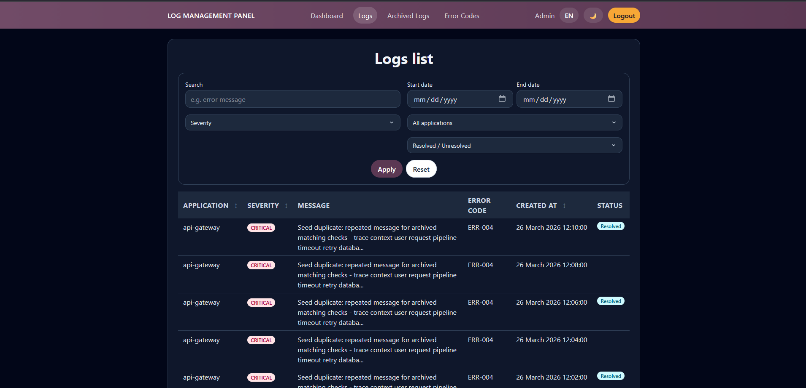
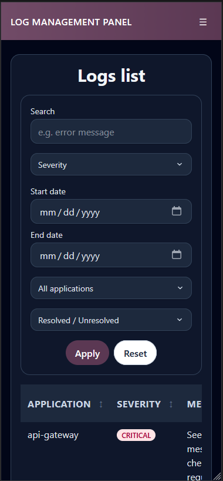

# Listado de Logs

## Titulo de la vista

Vista principal de consulta de logs activos.

## Descripcion funcional

Esta pantalla muestra los logs activos en formato tabla. Incluye herramientas de busqueda, filtrado y ordenacion para localizar incidencias de forma rapida.

## Objetivo para el usuario

Facilitar la revision operativa de los errores registrados sin necesidad de entrar en el detalle de cada caso.

## Elementos visibles

- Campo de busqueda por texto libre.
- Filtros por severidad.
- Filtro por rango de fechas.
- Filtro por aplicacion.
- Filtro por estado resuelto o no resuelto.
- Botones para aplicar filtros y restablecerlos.
- Tabla paginada con columnas de aplicacion, severidad, mensaje, error code, fecha y estado.

## Acciones disponibles

- Buscar logs por texto contenido en el registro.
- Filtrar por severidad, aplicacion, fechas y estado.
- Ordenar resultados por aplicacion, severidad o fecha.
- Abrir el detalle de un log pulsando sobre el mensaje.
- Mantener el contexto de filtros durante la navegacion.

## CAPTURAS

 
*Figura 1. Pantalla de Logs*

---

 
*Figura 2. Pantalla de Logs para móvil*

