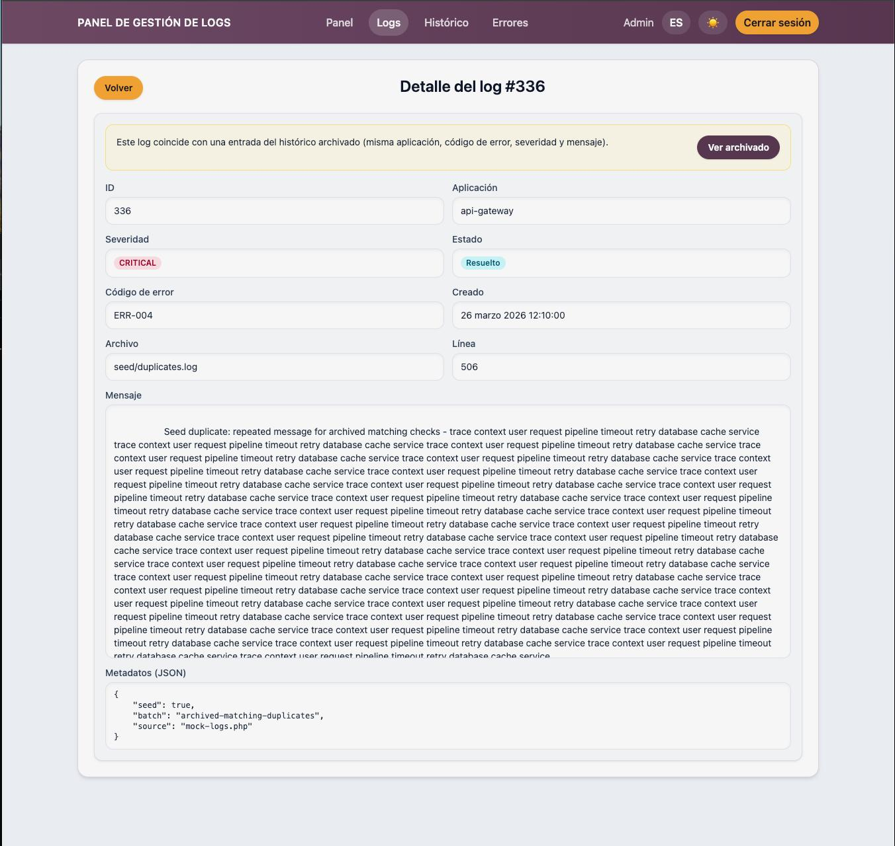
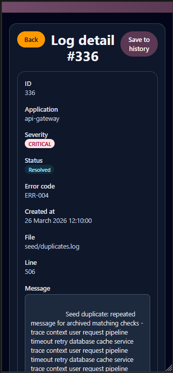

# Detalle de Log Activo

## Titulo de la vista

Vista de detalle de un log activo.

## Descripcion funcional

Esta pantalla muestra toda la informacion disponible de un log concreto. Sirve para analizar el error antes de marcarlo como resuelto o enviarlo al historico.

## Objetivo para el usuario

Ofrecer el contexto completo de la incidencia para decidir la accion operativa adecuada.

## Elementos visibles

- Boton para volver al listado anterior.
- Identificador del log.
- Aplicacion de origen.
- Severidad.
- Estado del log.
- Error code asociado.
- Fecha y hora de creacion.
- Fichero y linea de origen.
- Mensaje completo del error.
- Metadatos en formato JSON, si existen.
- Aviso cuando el log ya tiene una version archivada.

## Acciones disponibles

- Volver al listado manteniendo el contexto previo.
- Archivar el log cuando todavia no existe una copia en historico.
- Marcar el log como solucionado.
- Abrir el detalle archivado si el sistema detecta una coincidencia ya archivada.

## CAPTURA

 
*Figura 1. Pantalla de detalles de log*

---

 
*Figura 2. Pantalla de detalles de log para movil*
