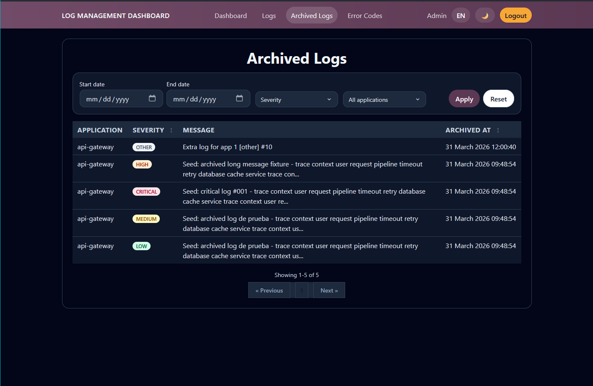
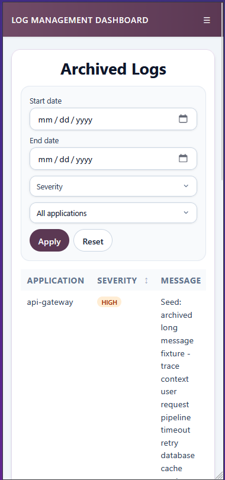

# Listado de Logs Archivados

## Titulo de la vista

Vista de historico de logs archivados.

## Descripcion funcional

Esta pantalla recoge los logs que ya han sido archivados para seguimiento posterior. Permite consultar incidencias cerradas o en analisis con filtros similares a los del listado principal.

## Objetivo para el usuario

Concentrar el historico de incidencias tratadas y facilitar su consulta posterior.

## Elementos visibles

- Filtro por rango de fechas.
- Filtro por severidad.
- Filtro por aplicacion.
- Botones para aplicar filtros y restablecerlos.
- Tabla paginada con aplicacion, severidad, mensaje y fecha de archivado.

## Acciones disponibles

- Filtrar los registros archivados.
- Ordenar por severidad o fecha de archivado.
- Abrir el detalle de un log archivado pulsando sobre su fila.
- Consultar el historico sin mezclar registros activos.

## CAPTURA

 
*Figura 1. Pantalla histórico de logs*

---

 
*Figura 2. Pantalla histórico de logs para móvil*

---