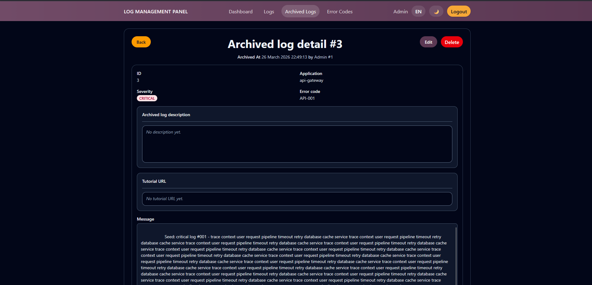
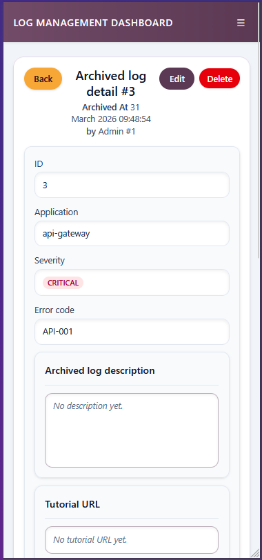

# Detalle de Log Archivado

## Titulo de la vista

Vista de seguimiento de un log archivado.

## Descripcion funcional

Esta pantalla amplía el detalle del log archivado con informacion de seguimiento. Ademas del contenido original del error, permite trabajar con una descripcion funcional, una URL de tutorial y un hilo de comentarios.

## Objetivo para el usuario

Centralizar el conocimiento operativo generado alrededor de una incidencia ya archivada.

## Elementos visibles

- Boton de retorno a la vista anterior.
- Cabecera con identificador, fecha de archivado y usuario que lo archivo.
- Datos base del log: aplicacion, severidad, error code y mensaje.
- Campo de descripcion editable para documentar la incidencia.
- Campo de URL tutorial para enlazar material de apoyo.
- Botones de editar, guardar y cancelar cuando el usuario tiene permisos.
- Boton de borrar registro archivado cuando el usuario esta autorizado.
- Hilo de comentarios con editor enriquecido.

## Acciones disponibles

- Editar la descripcion del caso archivado.
- Guardar o cancelar cambios en descripcion y URL tutorial.
- Abrir la URL tutorial en una nueva pestana.
- Anadir comentarios de seguimiento.
- Consultar comentarios previos del equipo.
- Eliminar la entrada archivada si el rol del usuario lo permite.

## CAPTURA

 
*Figura 1. Pantalla de detalles de log archivado*

---

 
*Figura 2. Pantalla de detalles de log archivado para móvil*