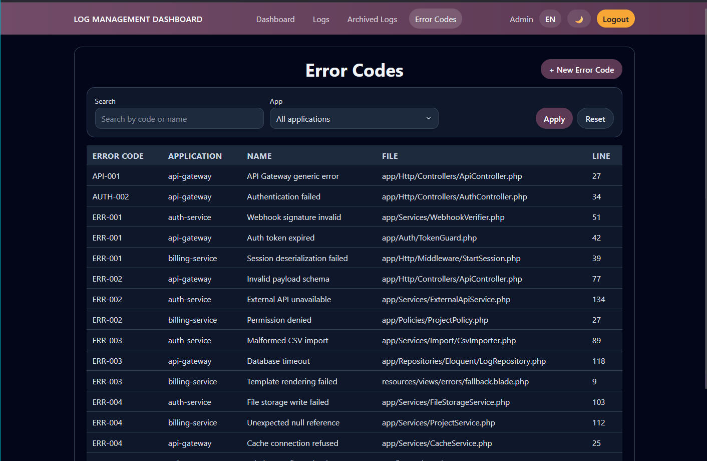
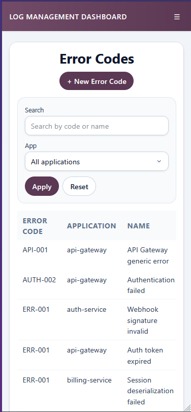

# Listado de Error Codes

## Titulo de la vista

Catalogo de error codes registrados en el sistema.

## Descripcion funcional

Esta pantalla muestra el inventario de error codes conocidos para cada aplicacion. Permite localizar rapidamente codigos existentes y acceder a su detalle para más informacion.

## Objetivo para el usuario

Mantener un catalogo centralizado de codigos de error reutilizable en el analisis de logs.

## Elementos visibles

- Boton para crear un nuevo error code.
- Campo de busqueda por texto.
- Filtro por aplicacion.
- Botones para aplicar filtros y restablecerlos.
- Tabla con columnas de codigo, aplicacion, nombre, fichero y linea.

## Acciones disponibles

- Buscar un error code por codigo, nombre u otro texto relevante.
- Filtrar el catalogo por aplicacion.
- Acceder al detalle de un error code pulsando sobre la fila.
- Crear un nuevo registro desde el boton superior.

## CAPTURA

 
*Figura 1. Pantalla de Errores*

---

 
*Figura 2. Pantalla de Errores para móvil*