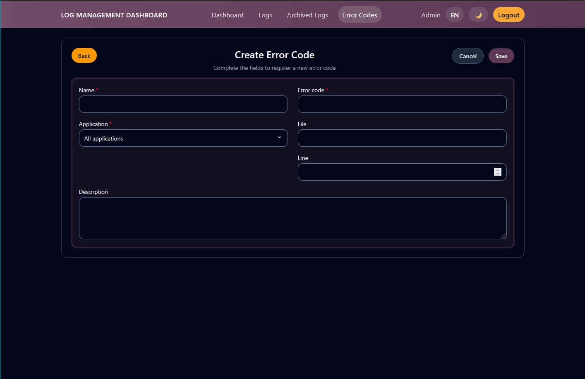
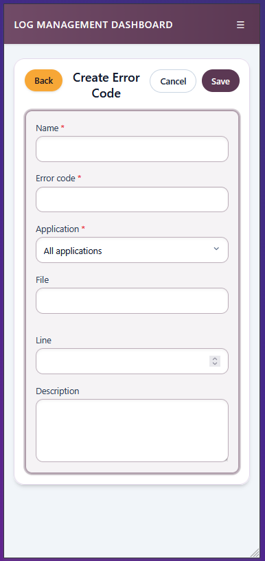

# Alta de Error Code

## Titulo de la vista

Formulario de creacion de un nuevo error code.

## Descripcion funcional

Esta pantalla permite registrar un nuevo codigo de error en el catalogo. El formulario recoge la informacion tecnica y descriptiva necesaria para reutilizar el codigo en futuras incidencias.

## Objetivo para el usuario

Dar de alta nuevos codigos estandarizados y mantener el catalogo actualizado.

## Elementos visibles

- Boton de vuelta al listado.
- Cabecera con titulo y subtitulo de alta.
- Formulario con los campos: aplicacion, severidad, codigo, nombre, fichero, linea y descripcion.
- Mensajes de validacion por campo cuando existen errores.
- Botones de cancelar y guardar.

## Acciones disponibles

- Introducir los datos del nuevo error code.
- Cancelar la creacion y volver al listado.
- Guardar el registro para acceder despues a su vista de detalle.

## CAPTURA

 
*Figura 1. Pantalla de crear Errores*

---

 
*Figura 2. Pantalla de crear Errores para móvil*