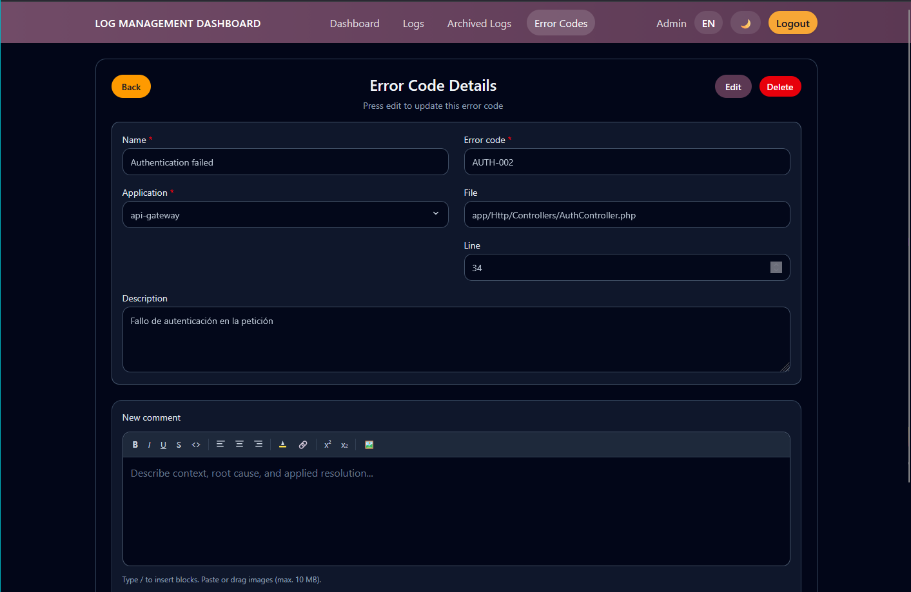
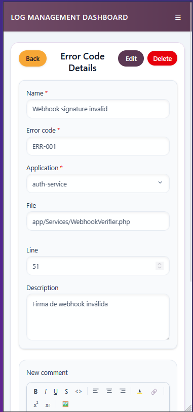

# Detalle y Edicion de Error Code

## Titulo de la vista

Vista de detalle y mantenimiento de un error code existente.

## Descripcion funcional

Esta pantalla combina la consulta del registro con su edicion posterior. Inicialmente muestra la informacion en modo lectura y permite activar la edicion cuando sea necesario.

## Objetivo para el usuario

Revisar un error code existente, actualizar sus datos y dejar trazabilidad mediante comentarios.

## Elementos visibles

- Boton para volver al listado.
- Cabecera con titulo general del modulo.
- Formulario en modo lectura o edicion segun el estado de la pantalla.
- Campos de aplicacion, severidad, codigo, nombre, fichero, linea y descripcion.
- Botones de editar, cancelar, guardar y borrar segun el contexto.
- Hilo de comentarios asociado al error code.

## Acciones disponibles

- Activar el modo edicion.
- Guardar cambios del error code.
- Cancelar la edicion y recuperar el estado anterior.
- Eliminar el registro mediante confirmacion.
- Anadir y consultar comentarios relacionados.

## CAPTURA

 
*Figura 1. Pantalla de detalles de Errores*

---

 
*Figura 2. Pantalla de detalles Errores*